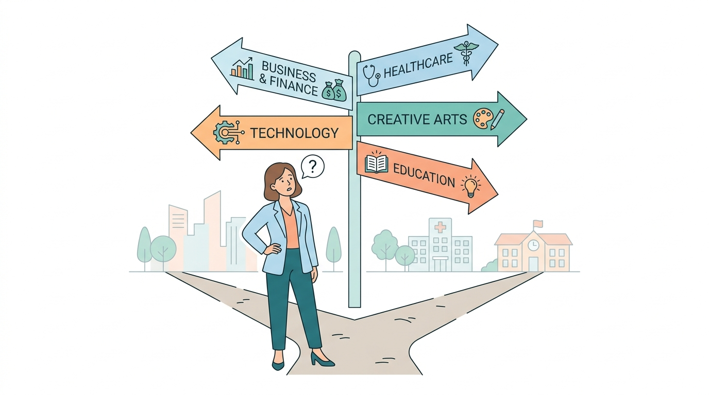
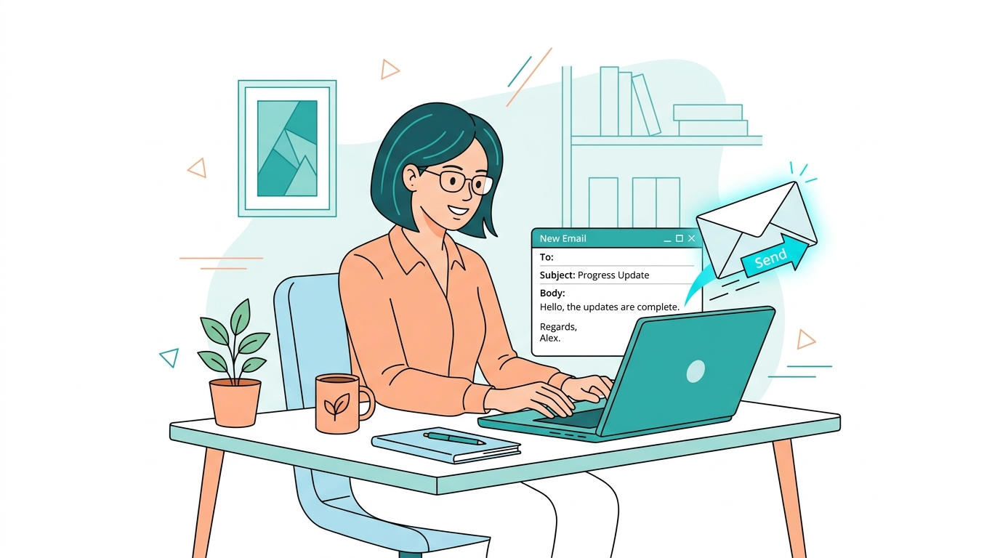

<!-- _class: lead -->
# Bridging the Gap
## From Academic Excellence to Employability
A proposal to integrate structured soft-skills training into the regular timetable.

---

# The "Degree vs. Employability" Gap
Our students are graduating with strong technical knowledge, but industry feedback consistently highlights a gap in communication, professional presence, and interview readiness. 

This directly impacts our campus placement conversion rates.

---

# The Need for Structure
Ad-hoc workshops and guest lectures are helpful but insufficient. 

Soft skills are **habits** that must be built over time, not memorized in a weekend. We need a continuous, week-by-week structured curriculum.

---

# A Modern, Tailored Curriculum
We have designed a comprehensive, multi-semester digital curriculum. 

Instead of textbooks, students engage with a modern web application that houses their weekly themes, rubrics, and interactive tasks.

---

# Not "One Size Fits All"
The communication needs of a B.Com student differ from those of an MBA or BCA student. 

- **UG Focus:** Foundational presence, active listening, and early career awareness.
- **PG Focus:** Advanced negotiation, financial storytelling, and crisis management.

---

# How the Journey Unfolds
- **Phase 1: Core Foundations** 
  Self-awareness, articulation.
- **Phase 2: Collaborative Dynamics** 
  Meetings, group discussions, teamwork.
- **Phase 3: The Execution Phase** 
  Resume building, STAR method interviews, mock panels.

---

# Active Learning, Not Passive
The time allocated won't be standard lectures. 

- **Briefing:** Introducing the week's theme via the app.
- **Application:** Peer reviews, role-playing, and mock interviews.
- **Assessment:** Immediate, structured feedback based on standard rubrics.

---

# Why This Benefits Us All
By institutionalizing this training, we take ownership of our students' ultimate success.

1. Higher conversion rates during campus placement drives.
2. Increased confidence and professional maturity on campus.
3. A stronger institutional reputation among corporate recruiters.

---

# Integrating into the Academic Fabric
We are requesting an allocation of **3 hours per week** integrated directly into the regular student timetable. 

Treating this as a mandatory, time-tabled subject ensures 100% participation and signals its importance to the students.

---

<!-- _class: lead -->
# Moving Forward
Approval of the 3-hour weekly allocation for the upcoming semester.

**Next Phase:** Faculty orientation on utilizing the digital curriculum app to seamlessly run the sessions.

